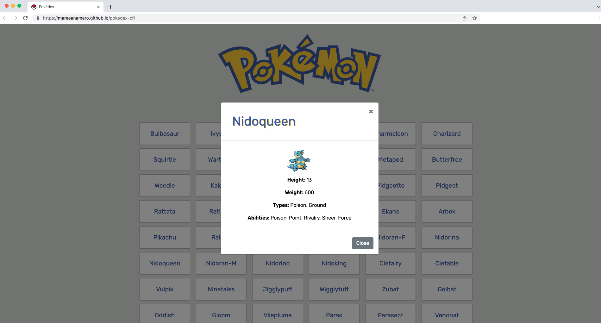

# Project Description
This project was part of the Career Foundry Full Stack Web Development course. It's a small web application with HTML, CSS, and JavaScript that loads data from an external API and enables the viewing of data points in detail.

This app lists out the 150 first gen Pokémon and allows the user to access more details about each one.

## Key features
* Load data from an external source (API)
* View a list of items
* On user action (e.g., by clicking on a list item), view details for that item

## Project Dependencies
Javascript ES6, ESLint rules, jQuery, Bootstrap

## API used:
[Pokémon API](https://pokeapi.co/)

## Links
* **Repository:** https://github.com/mareeanamaro/pokedex-cf
* **Live link:** https://mareeanamaro.github.io/pokedex-cf/ 

